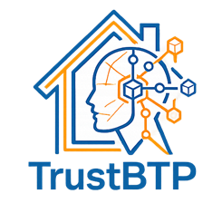

# Trust BTP

[](LICENSE)
[](https://sepolia.arbiscan.io)
[]()

<p align="center">
  
</p>

> **Trust BTP** — Plateforme Web3 qui sécurise les paiements de travaux entre particuliers et artisans via un escrow smart contract à jalons, génère du yield DeFi (Aave v3) sur les fonds en attente, et construit la réputation on-chain via un Trust Score automatique. Architecture **compliance-first** (orchestrateur technique non-custodial).

---

## 📂 Contenu du repo

```
Alyra-TrustBTP/
├── README.md                     ← ce fichier
│
├── frontend/                     ← dApp Next.js 16 + TypeScript + Tailwind + wagmi/viem + Reown AppKit
│   ├── src/app/                  ← pages App Router
│   ├── src/components/           ← UI chantier, owner, shared (shadcn/ui)
│   ├── src/hooks/                ← logique blockchain (useChantier, useJalonActions, useTrustScore…)
│   └── src/lib/                  ← ABIs, contracts, client
│
├── backend/                      ← smart contracts Solidity 0.8.28 + Hardhat 3
│   ├── contracts/
│   │   ├── EscrowVault.sol       ← coffre principal non-custodial
│   │   ├── TrustScoreRegistry.sol
│   │   ├── yield/                ← AaveV3YieldProvider (ERC-4626)
│   │   ├── interfaces/           ← IYieldProvider, IChantierNFT, ITrustScoreRegistry
│   │   └── libraries/            ← structs Chantier, Jalon
│   ├── test/                     ← tests Hardhat (EscrowVault, Yield)
│   └── ignition/                 ← déploiement (local, Sepolia, Base Sepolia, Arbitrum Sepolia)
│
└── docs/                         ← documentation complète
    ├── architecture.md           ← architecture protocole
    ├── business-rules.md         ← règles métier
    ├── contract-abi.md           ← référence ABI
    ├── image.png · UX_*.png      ← mockups UX
    └── alyra/                    ← livrables cas pratique Alyra (9 fichiers)
        ├── 01-Veille_360.xlsx                    ← veille 360°
        ├── 02-Legal_Design_OnePager.pptx         ← one-pager « Le droit & notre projet »
        ├── 03-Note_Juridique.docx                ← note juridique 2 pages
        ├── 04-User_Stories.pptx + .docx          ← user stories (Artisan / Particulier / Gouvernance)
        ├── 05-Business_Model_Canvas.pptx         ← BMC Web3
        ├── 06-Annexe_Juridique_Devis.docx        ← annexe juridique au devis (10 articles)
        ├── 07-Pitch_60s_Script.docx              ← script + storyboard du pitch
        ├── 08-Narratif_Revolutionnaire.docx      ← narratif projet
        └── 09-Pitch_Video_60s.mp4                ← vidéo pitch 60s (à voicer over)
```

---

## 🚀 Démarrage rapide

### Frontend (dApp)
```bash
cd frontend
npm install
cp .env.example .env.local   # WALLETCONNECT_PROJECT_ID, RPC_URL, CONTRACT_ADDRESSES
npm run dev
```
Ouvrir http://localhost:3000

### Backend (contrats Solidity)
```bash
cd backend
npm install
npx hardhat test
npx hardhat ignition deploy ignition/modules/LocalTrustBTP.ts --network localhost
```

### Déployer sur Vercel
```bash
cd frontend
vercel
```

---

## 🧩 Concepts clés

| Terme | Définition |
|---|---|
| **Escrow non-custodial** | Fonds bloqués dans le smart contract. Trust BTP ne peut ni les déplacer ni les débloquer unilatéralement. |
| **Jalon** | Étape du chantier. Validée en **pair-à-pair** par le particulier et l'artisan. Paiement libéré automatiquement. |
| **NFT chantier (soulbound)** | Token non-transférable (ERC-721) mis à jour à chaque étape. Regroupe devis, clauses, preuves. Valeur probatoire (art. 1366 CC). |
| **Trust Score** | Score de réputation artisan (0–100) calculé on-chain à partir de l'historique. |
| **Yield opt-in** | Option supply-only Aave v3 sur les fonds en attente. Rendement partagé en **crédits travaux** (non numéraire). |
| **Médiation CECMC** | Prestataire tiers indépendant en cas de litige. Arbitrage CMAP si nécessaire. Trust BTP n'arbitre jamais. |

---

## 🏛 Architecture juridique (compliance-first)

Trust BTP agit exclusivement comme **orchestrateur technique non-custodial** :

- **ne détient jamais les fonds** (ségrégation on-chain)
- **n'intervient jamais** dans la validation P2P des jalons
- **n'arbitre jamais** les litiges (médiation CECMC + arbitrage CMAP tiers)
- **ne fournit aucun conseil** financier, juridique ou en investissement

Services réglementés externalisés vers partenaires agréés :
- **PSP ACPR** (flux fiat — Lemonway / Mangopay / Treezor)
- **EMI Monerium** (EURe MiCA Titre III)
- **Partenaire CASP régulé** (supply DeFi)
- **Médiateur CECMC** + arbitre **CMAP** (litiges)

Voir [`docs/alyra/06-Annexe_Juridique_Devis.docx`](docs/alyra/06-Annexe_Juridique_Devis.docx) pour l'intégralité des 10 clauses contractuelles embarquées dans le devis.

---

## 📚 Documentation

- [Architecture détaillée](docs/architecture.md)
- [Règles métier](docs/business-rules.md)
- [Référence ABI contrats](docs/contract-abi.md)
- [Livrables Alyra](docs/alyra/)

---

## ⚠ Avertissement

Projet à but académique (certification Alyra) et expérimental. Les smart contracts n'ont pas été audités par des professionnels agréés. Les qualifications juridiques mentionnées sont des modèles de rédaction à valider par un avocat spécialisé avant toute utilisation commerciale.

## 📄 License

MIT
